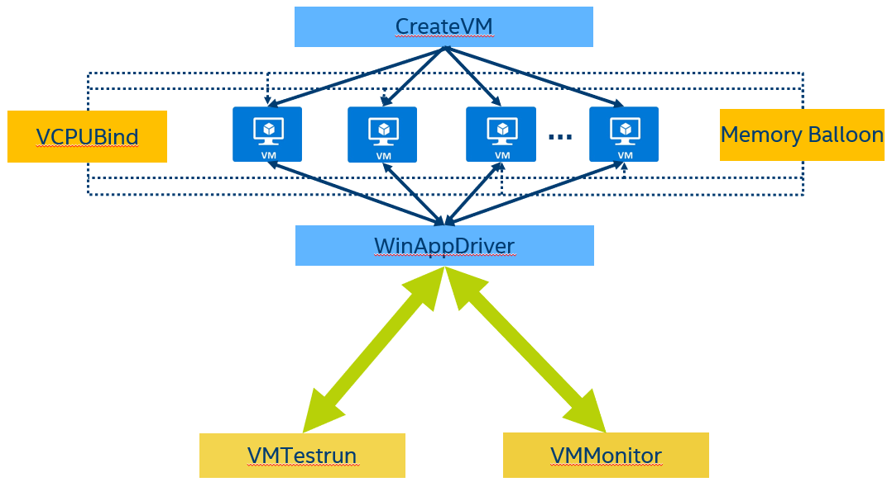

# VDI Toolkit

The VDI(Virtual Desktop Infrastructure) Toolkit contains tools to automate the VDI solution test
and also scripts/utilities to optimize the platform performance for VDI workload

The automated test flow will utilize the Microsoft WinAppDriver framework as below:

# CreateVM 
CreateVM will create up to 512 VMs using Qemu, support bridge and NAT network connection, also support incremental mode and full image mode, 
the [CREATEVM_README](doc/CREATEVM_README.md) will give detailed guide

# VMTestrun 
VMTestrun contains the Python scripts to let VMs to run test scripts through WinAppDrver that installed on guest VMs, please refer to [VMTESTRUN_README](doc/VMTESTRUN_README.md) 

# VCPUBind and MemoryBalloon 
VCPUBind and MemoryBalloon are scripts to utilize the VM's vcpu NUMA binding and the memory balloon feature, please refer to 
[BINDVCPU_README](doc/BINDVCPU_README.md) and [BALLOON_README](doc/BALLOON_README.md) 

# VMMonitor 
VMMonitor is a tool to profiling the VMs and do snapshot or directly connect to independent VMs through VNC or RDP

# The dgpu directory 
The dgpu directory is the GPU related VDI scripts and samples, please also refer to [README](dgpu/scripts/Readme.txt)

Dependencies for dGPU:
nlohmann's json is required to parse configuration files. In order to get this component, it is required to clone it from https://github.com/nlohmann/json.git and copy the \include\nlohmann folder to \dgpu\mediasample\MediaSample\deps\include so that it could be used by the media sample.