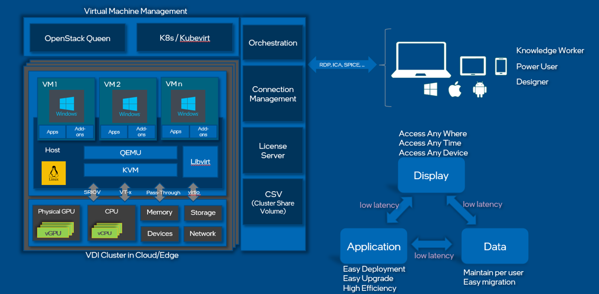

# Intel VDI Tool Kit
## Introduction
Intel VDI Tool kit is a tool set to optimize VDI solution benchmarking test and performance tuning based on Intel Platforms. The Tool kit provides following functions for users to deploy and test VDI in Intel Platform:

- Optimized scripts to deploy VMs in Xeon server
- Scripts and tools to enable vGPU for VMs with Intel Server GPU support
- Tools and configurations to automate functional and performance test for VDI solution
- Scripts and utilities to optimize the performance of VDI workload

Intel provides platform-level support for all VDI usages w/o dGPU support. The following figure is a high-level architecture of VDI solution:

## Utilities for VDI Deployment in Xeon Server
Intel VDI Tool Kit provides relative functions and scripts to enable or optimize VDI with special purposes. You can get details from [Utils](./utils/README.md)

## VDI Auto Test Facilities
VDI solution needs to provide different configuraiton for different use scenarios. To get the best TCO for one usages, an easy-to-use benchmark tool is must. Scripts in utils provide quick ways to deploy VMs in VDI server; assets in vm folder provide test automation facility to benchmark VDI with special applications. Please go to [Test facility](./vm/README.md) for details.

## Enable VGPU in VDI with Intel Server GPU
GPU acceleration for VDI solution is very critical for profession and power VDI users. Intel Server GPU series provide SRIOV-based GPI virtualization for VDI solutions. To enable Intel server GPU virutalization feature for VDI, you can refer to:

- [Manual and scripts to enable vGPU for VMs](./dgpu/scripts/Host/README.md)
- [Enable relative feature in Windows Guest](./dgpu/scripts/Windows_Guest/README.md)
- [How to utilize the media encoder feature with Intel oneVPL SDK in windows guest](./dgpu/mediasample/README.md)

## License
Intel VDI Tool Kit is licensed under MIT license. Note that MIT license is only the license for Intel VDI Tool Kit itself, independent of its third-party dependencies, which are separately licensed.
