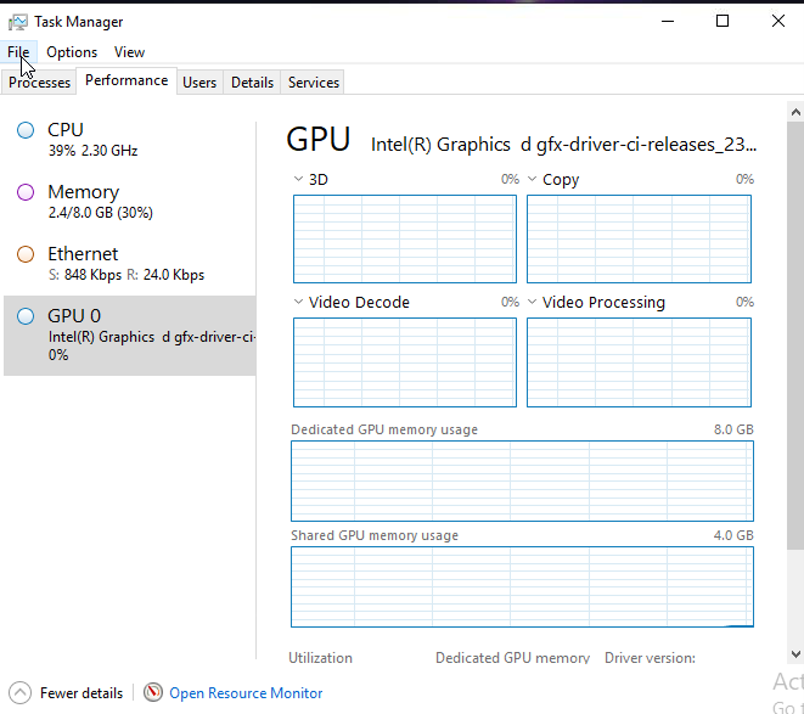
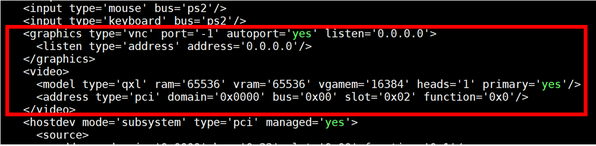

# Windows_Guest Script Guide
These scripts are used to generate VDD in the VM. They shall be run with powershell. Before using these scripts, firstly Windows graphics driver is need to be installed.

## Install Windows Graphic Driver
Unzip the download Windows Graphic Driver file and an executable file ``installer.exe`` will appear in the unzipped folder. Running the ``installer.exe`` with Administrator mode will complete the driver installation.

1. ``ManualInstall.bat`` is used to manually install driver, enable an 2k virtual display, then auto reboot Windows. It is required to unzip the graphics driver package before running this script.
2. ``SilentInstall.bat`` is used to silient install driver, enable an 2k virtual display, then auto reboot Windows. It is required to unzip the graphics driver package before running this script.

When installation is completed, reboot the system to make it take effect. We could observe a device “GPU0” in the task manager if the installation succeeded.

<div align=center></div>

## Enable 2K/4K Virtual Display with Scripts
1. For Flex 140 (device id is 8086 56c1 in lspci & device manager), use Windows Powershell to run following commands:
```shell
install-Flex140.ps1 -enable 2k   # enable virtual display and 2k mode
install.Flex140.ps1 -enable 4k   # enable virtual display and 4k mode
install.Flex140.ps1 -disable     # disable virtual display
```

2. For Flex 170 (device id is 8086 56c0 in lspci & device manager), use Windows Powershell to run following commands:
```shell
install-Flex170.ps1 -enable 2k   # enable virtual display and 2k mode
install.Flex170.ps1 -enable 4k   # enable virtual display and 4k mode
install.Flex170.ps1 -disable     # disable virtual display
```
After running the script, it is required to reboot VM to let the script take effect.

## Remove the default QXL Display
Once VDD is correctly configured, it is suggested to remove the original QXL Display of the VM to avoid conflict or related issues. In order to do that, we need to shut down the related VMs and use virt-shell to edit them:
```shell
$ virsh edit ${VM_Name}
```
In the XML config file of the VM, delete all contents in \<graphics\> and \<video\> section, then the default QXL display will be removed.

<div align=center></div>

Then restart the VM and we can enable VNC or RDP to access it.
