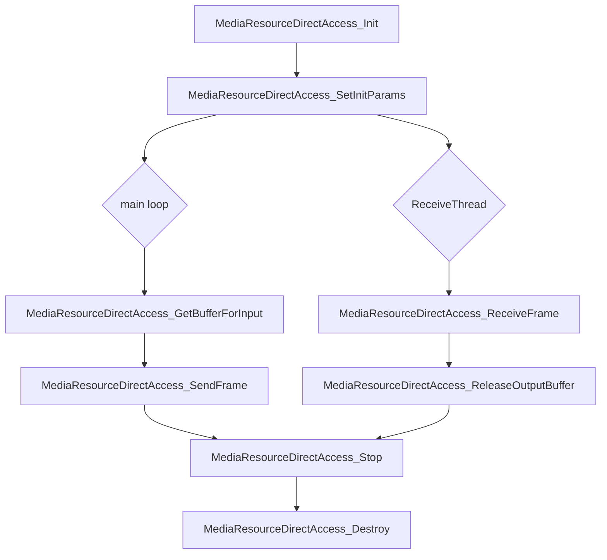

# Media Resource Direct Access API Documentation

## Overview

The Media Resource Direct Access API provides a way to access media resources directly from the host server for guest, without the need for a guest-side driver. This functionality leverages the IVSHMEM shared memory technology to facilitate seamless data interaction between the virtual machines and the host system. These APIs are designed to be used by developers who want to build custom applications that can access media resources using MRDA lib.

## API Introduction

### 1. MediaResourceDirectAccess_Init

#### Description

This function initializes Media Resource Direct Access Library and get library handle.
It must be called before any other MRDA functions.

#### Prototype

```c
MRDAHandle MediaResourceDirectAccess_Init(const TaskInfo *taskInfo, const ExternalConfig *config);
```

#### Parameters
- `taskInfo`: A pointer to a TaskInfo structure that contains information about the task that is calling the function.
- `config`: A pointer to an ExternalConfig structure that contains configuration information for the Media Resource Direct Access Library.

#### Return Value
- `MRDAHandle`: A handle to the Media Resource Direct Access Library. This handle is used to access the library's functions.

### 2. MediaResourceDirectAccess_Stop

#### Description

This function stops the Media Resource Direct Access Library and stop the host service.

#### Prototype

```c
MRDAStatus MediaResourceDirectAccess_Stop(MRDAHandle handle);
```

#### Parameters
- `handle`: A handle to the Media Resource Direct Access Library.

#### Return Value
- `MRDAStatus`: The status of the operation. If the operation is successful, the return value will be MRDA_STATUS_SUCCESS.

### 3. MediaResourceDirectAccess_Reset

#### Description

This function resets the Media Resource Direct Access Library and reset the host service.
Note: This function has not been implemented yet.

#### Prototype

```c
MRDAStatus MediaResourceDirectAccess_Reset(MRDAHandle handle, TaskInfo *taskInfo);
```

#### Parameters
- `handle`: A handle to the Media Resource Direct Access Library.
- `taskInfo`: A pointer to a TaskInfo structure that contains information about the task that is calling the function.

#### Return Value
- `MRDAStatus`: The status of the operation. If the operation is successful, the return value will be MRDA_STATUS_SUCCESS.

### 4. MediaResourceDirectAccess_Destroy
#### Description

This function destroys the Media Resource Direct Access Library and release the resources.
It must be called after all other MRDA functions have been called.

#### Prototype

```c
MRDAStatus MediaResourceDirectAccess_Destroy(MRDAHandle handle);
```

#### Parameters
- `handle`: A handle to the Media Resource Direct Access Library.

#### Return Value
- `MRDAStatus`: The status of the operation. If the operation is successful, the return value will be MRDA_STATUS_SUCCESS.

### 5. MediaResourceDirectAccess_SetInitParams
#### Description

This function sets the initialization parameters for the Media Resource Direct Access Library.

#### Prototype

```c
MRDAStatus MediaResourceDirectAccess_SetInitParams(MRDAHandle handle, const MediaParams *mediaParams);
```

#### Parameters
- `handle`: A handle to the Media Resource Direct Access Library.
- `mediaParams`: A pointer to a MediaParams structure that contains the initialization parameters.

#### Return Value
- `MRDAStatus`: The status of the operation. If the operation is successful, the return value will be MRDA_STATUS_SUCCESS.

### 6. MediaResourceDirectAccess_GetBufferForInput
#### Description

This function gets a share memory internal buffer for input data from the Media Resource Direct Access Library.

#### Prototype

```c
MRDAStatus MediaResourceDirectAccess_GetBufferForInput(MRDAHandle handle, std::shared_ptr<FrameBufferItem> &inputFrameData);
```

#### Parameters
- `handle`: A handle to the Media Resource Direct Access Library.
- `inputFrameData`: A reference to a shared pointer to a FrameBufferItem structure that will be used to store the input data.

#### Return Value
- `MRDAStatus`: The status of the operation. If the operation is successful, the return value will be MRDA_STATUS_SUCCESS.

### 7. MediaResourceDirectAccess_ReleaseOutputBuffer
#### Description

This function releases the share memory internal output buffer from the Media Resource Direct Access Library.

#### Prototype

```c
MRDAStatus MediaResourceDirectAccess_ReleaseOutputBuffer(MRDAHandle handle, std::shared_ptr<FrameBufferItem> outputFrameData);
```

#### Parameters
- `handle`: A handle to the Media Resource Direct Access Library.
- `outputFrameData`: A reference to a shared pointer to a FrameBufferItem structure that contains the output data.

#### Return Value
- `MRDAStatus`: The status of the operation. If the operation is successful, the return value will be MRDA_STATUS_SUCCESS.

### 8. MediaResourceDirectAccess_SendFrame
#### Description

This function sends a frame of data to the Media Resource Direct Access Library for processing.

#### Prototype

```c
MRDAStatus MediaResourceDirectAccess_SendFrame(MRDAHandle handle, std::shared_ptr<FrameBufferItem> inputFrameData);
```

#### Parameters
- `handle`: A handle to the Media Resource Direct Access Library.
- `inputFrameData`: A reference to a shared pointer to a FrameBufferItem structure that contains the input data.

#### Return Value
- `MRDAStatus`: The status of the operation. If the operation is successful, the return value will be MRDA_STATUS_SUCCESS.

### 9. MediaResourceDirectAccess_ReceiveFrame
#### Description

This function receives a frame of data from the Media Resource Direct Access Library after processing.

#### Prototype

```c
MRDAStatus MediaResourceDirectAccess_ReceiveFrame(MRDAHandle handle, std::shared_ptr<FrameBufferItem> &outputFrameData);
```

#### Parameters
- `handle`: A handle to the Media Resource Direct Access Library.
- `outputFrameData`: A reference to a shared pointer to a FrameBufferItem structure that will be used to store the output data.

#### Return Value
- `MRDAStatus`: The status of the operation. If the operation is successful, the return value will be MRDA_STATUS_SUCCESS.

## API Call Flow

The following diagram illustrates the flow of API calls for the Media Resource Direct Access Library.



## Example Usage

The following examples demonstrate how to use the Media Resource Direct Access Library to process media data.

- Sample encode: [`sample_encode.cpp`](../Examples/SampleEncodeApp/src/sample_encode.cpp)
- Sample decode: [`sample_decode.cpp`](../Examples/SampleDecodeApp/src/sample_decode.cpp)