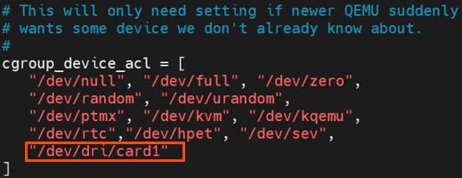
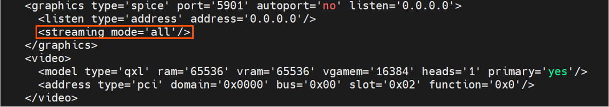
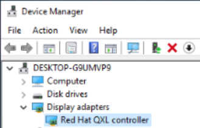

# Spice-plugins
This module includes patches and scripts for spice library to enable HW stream encoder.

OS: CentOS 7.

Main dependencies: libvirt, qemu-kvm, virt-viewer, spice, gstreamer.

The ``patches`` folder includes the patches to enable the HW gstreamer-vaapi:jpegenc feature.

The ``scripts`` folder includes the scripts to setup the environment, and compile and install
gstreamer-1.20.3, spice-protocol-0.14.0 and spice-server-0.14.3.

## Patches
### gstreamer
This patch fixes a compile error with recent upstream FFmpeg:

``0001-avviddec-change-AV_CODEC_CAP_AUTO_THREADS-AV_CODEC_C.patch``

This patch disables libjpeg-turbo SIMD acceleration support to avoid jpegdec failure when format is converted to BGRx:

``0002-jpegdec-Disable-libjpeg-turbo-SIMD-acceleration-supp.patch``
### spice-protocol
This patch adds vaapijpeg type for HW encoder:

``0001-Add-HW-encoder-codec-type.patch``
### spice
This patch changes url of submodules spice-common to avoid sync failure:

``0001-Change-url-of-submodules-spice-common.patch``

This patch enables gstreamer-vaapi:jpegenc for spice-server stream encoder:

``0002-Enable-HW-vaapi-jpeg-encoder.patch``

This patch workarouds an invalid characters glib warning of '-a-png-encoder-pred':

``0003-libav-Fix-for-APNG-encoder-property-registration.patch``

## Scripts
### Install platform
This script is used to install kernel, media and ffmpeg from platform packages.

The path of downloaded and unzipped platform pacakges is needed as param.

Below is an example of using this script:
```bash
./0_install_platform.sh --platform-path="/${your_path}/*-data-center-gpu-c7.4-k*"
```
With platform installation complete, please refer to [Tune kernel parameters](../../dgpu/scripts/Host/README.md)
session to set kernel parameters, change default boot kernel and reboot to make the change take effect.

###  Install gstreamer
This script is used to compile and install gstreamer-1.20.3.

The default yum installed gstreamer-1.10.4 doesn't support Intel(R) Media Driver for VAAPI.

To realize the feature, gstreamer-1.20.3 needs to be compiled and installed.

The custom_subprojects include "gst-plugins-base,gst-plugins-good,gst-plugins-bad,gst-plugins-ugly, gst-libav and gstreamer-vaapi".

The installation path is set as "/opt/intel/gst".

Below is an example of using this script:
```bash
./1_install_gstreamer.sh
```
**Notes**: Platform packages must be installed first!

With gstreamer installation complete, below commands can be run to check if gstreamer is successfully installed:
```bash
export LD_LIBRARY_PATH=/opt/intel/gst/lib:/opt/intel/gst/lib/gstreamer-1.0:${LD_LIBRARY_PATH}
cd /opt/intel/gst/bin
./gst-launch-1.0 --version
```
The output should be like:
```
gst-launch-1.0 version 1.20.3
GStreamer 1.20.3
https://gitlab.freedesktop.org/gstreamer
```

When first time running, there might be libvainfo:
```
libva info: VA-API version 1.18.0
libva info: User environment variable requested driver 'iHD'
libva info: Trying to open /usr/lib64/dri/iHD_drv_video.so
libva info: Found init function __vaDriverInit_1_18
libva info: va_openDriver() returns 0
```

Below commands can be run to check if gstreamer-vaapi can work normally:
```bash
export LD_LIBRARY_PATH=/opt/intel/gst/lib:/opt/intel/gst/lib/gstreamer-1.0:${LD_LIBRARY_PATH}
export LIBVA_DRIVER_NAME=iHD
export LIBVA_DRIVERS_PATH=/usr/lib64/dri
cd /opt/intel/gst/bin
./gst-inspect-1.0 vaapi
```

The output should be like:
```
Plugin Details:
  Name                     vaapi
  Description              VA-API based elements
  Filename                 /opt/intel/gst/lib/gstreamer-1.0/libgstvaapi.so
  Version                  1.20.3
  License                  LGPL
  Source module            gstreamer-vaapi
  Source release date      2022-06-15
  Binary package           gstreamer-vaapi
  Origin URL               https://gitlab.freedesktop.org/gstreamer

  vaapiav1dec: VA-API AV1 decoder
  vaapidecodebin: VA-API Decode Bin
  vaapih264dec: VA-API H264 decoder
  vaapih264enc: VA-API H264 encoder
  vaapih265dec: VA-API H265 decoder
  vaapih265enc: VA-API H265 encoder
  vaapijpegdec: VA-API JPEG decoder
  vaapijpegenc: VA-API JPEG encoder
  vaapimpeg2dec: VA-API MPEG2 decoder
  vaapioverlay: VA-API overlay
  vaapipostproc: VA-API video postprocessing
  vaapisink: VA-API sink
  vaapivp9dec: VA-API VP9 decoder
  vaapivp9enc: VA-API VP9 encoder
```

### Install spice
This script is used to compile and install spice-protocol-0.14.0 and spice-0.14.3.

Upgrade the spice-server library from v0.14.0(souce code has compile issue) to v0.14.3 and add implementation of gstreamer-vaapi:jpegenc with dependent libraries gstreamer1.20.3.

Upgrade the library from v0.12.4 to v0.14.0 according to the requirement of Spice repo.

The installation path is set as /opt/intel/spice.

The usage of this script shall be:
```bash
./2_install_spice.sh
```
**Notes**: gstreamer-1.20.3 must be installed first!

### Test Spice GST
This script is used to run unit tests for spice-sever stream encoder.

Env path will be set and two unit tests of spice/server:
"test-codecs-parsing" and "test-video-encoders" will be run.

The GPU card number is needed as a param to let gstreamer-vaapi to
find GPU device. The default value is 0, which means the GPU device path is "/dev/dri/card0".
If your GPU device is card1, you can add "--gpu-card=1" param to select it.
Below is an example of using this script:

```bash
./3_test_spice_gst.sh --gpu-card=1
```

The output should be like:
```
GPU_CARD=1
/server/codecs-good: OK
/server/codecs-bad: OK
Running test with options: -f 16BIT -e mjpeg
...
Running test with options: -f RGBA -e gstreamer-vaapi:jpeg --min-psnr 24 --clipping (10%,10%)x(409,307) --split-lines=40
```

Here replace intermediate output content with "..." to shorten the text.

If the script output ends in the middle or if there's any error or warnig logs, please check if
gstreamer-1.20.3 is successfully installed or if the GPU card number is setting correctly.

### Setup VM Spice Stream
This script is used to setup env path for qemu-commandline to enable gstreamer HW stream encoder.
The name of the VM is needed as param.

Besides this scripts, some other env setup steps are needed.

**Notes**: Need to set permissions in '/etc/libvirt/qemu.conf'：
1. Uncomment 'user = "root"'

2. Uncomment 'group = "root"'

3. Uncomment 'cgroup_device_acl' and add GPU device.

    The GPU card number shall be modified according to the device and it is 1 in below example.
<div align=center></div>

The modification of ``qemu.conf`` will take effect after running below commands:
```
sudo systemctl daemon-reload
sudo systemctl restart libvirtd
```

**Notes**: Need to add spice graphics device and qxl video device in VM.

And need to mannually add "streaming mode='all'" for "graphics spice" element as shown below.

```
sudo virsh edit $VM_NAME
```
<div align=center></div>

If there's a VGPU device, please remove it.

**Notes**: Need to install virtio driver in VM.

Download virtio driver from https://fedorapeople.org/groups/virt/virtio-win/direct-downloads/archive-virtio/virtio-win-0.1.215-2/virtio-win-0.1.215.iso
and copy the iso to the VM to be installed through share folder. Then, attach this ISO on the VM and run virtio-win-guest-tools.exe in the image to complete the installation. After installation, the "Display adapters" should include "Red Hat QXL controller".
<div align=center></div>

Finally use this script to setup the env path to enable HW stream encoder.
The name of the VM and the GPU card number are needed as params.
Below is an example of using this script:

```bash
sudo su
./4_setup_vm_spice_stream.sh --vm-name=win2k19 --gpu-card=1
```

Input "y" after confirming each env path edition.

Then start the VM and run virt-viewer, the streaming mode will be valid when playing a video.

GPU usage can be tested through tools of ``intel-gpu-top`` or ``xpu-smi`` to check if HW accelleration is enabled for spice stream encoding.

You can refer to [Dump Debug Info](../../dgpu/scripts/Host/VM_scripts.md) for more details about hwo to use these two tools.

For example:

```
sudo ./intel_gpu_top -d drm:/dev/dri/card1
sudo xpu-smi dump -m 0,2,5,33 -i 3 -d 0
```

When a video is playing in one VM, there will be GPU utilization and GPU memory Utilization increase.

Besides, uncomment the lines including 'env=GST_MESSAGE_DEBUG=all' and 'GST_DEBUG=5' in the script to print gst debug logs and run again, "vaapijpegenc" related logs can be found in '/var/log/libvirt/qemu/${VM_NAME}.log'.
