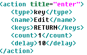

 **VDI-Toolkit User Manual**

**Table of Contents**

- [Get Ready](#get-ready)
- [VDI-Toolkit test environment setup](#vdi-test-environment-setup)
  - [Basic configuration of the server host](#basic-configuration-of-the-server-host)
  - [Create and install a Windows virtual machine](#create-and-install-a-windows-virtual-machine)
  - [Configure virtual machine remote connections](#configure-virtual-machine-remote-connections)
  - [Configure the test environment on the virtual machine](#configure-the-test-environment-on-the-virtual-machine)
  - [The virtual machine setting automatically triggers the WinAPPDriver](#the-virtual-machine-setting-automatically-triggers-the-winappdriver)
  - [VDI test description of the test content](#vdi-test-description-of-the-test-content)
  - [Additional considerations](#additional-considerations)
  - [Remote control environment setup and testing](#remote-control-environment-setup-and-testing)
  - [Linux remotely controls machine configuration](#linux-remotely-controls-machine-configuration)
  - [Launch the tests on VMs](#launch-the-tests-on-vms)


# Get Ready
1. Install on the server host: Centos 7.x (take Centos 7.9 as an example).
1. Prepare the Client: Win server 2016 iso image file.
1. Python2.7.18.
1. WinAppDriver.
1. WPS 2016.
1. Microsoft Edge.
1. VLC player.

# VDI test environment setup

## Basic configuration of the server host

1. Install GNOME Desktop with Centos 7.9

**Note:** The default kernel version of CentOS 7.4 may encounter the inability to install some of the newer network card drivers (X710/E810-C), and you can manually upgrade to CentOS 7.9

```bash
sudo yum clean all
sudo yum -y update
sudo reboot
cat /etc/redhat-release
```

2. Download the WinServer 2016 iso file to your local computer.
3. Windows does not support qcow2 format disks by default, so you must manually load the virtio driver when installing Windows Server  2016 [using qemu](https://fedorapeople.org/groups/virt/virtio-win/direct-downloads/archive-virtio/virtio-win-0.1.221-1/virtio-win.iso)
4. Use the following command to install the dependency packages of qemu and start qemu.

```bash
$ sudo yum -y install libvirt qemu-kvm virt-manager virt-install bridge-utils virt-viewer OVMF.noarch qemu-system-x86.x86_64
```

5. Upgrade the qemu-kvm version to 5.2

**Note:  If you need to use multi-queue related features, you need to upgrade to QEMU 5.2**

```bash
# Uninstall the original qemu-kvm
$ sudo yum –y remove qemu-kvm

# Install dependent dependencies
$ yum -y install gcc gcc-c++ automake libtool zlib-devel glib2-devel bzip2-devel libuuid-devel spice-protocol spice-server-devel usbredir-devel libaio-devel python3

# If you need to add QEMU to support ceph's rbd protocol
$ yum install -y ceph-devel-compat.x86\_64
$ pip3 install Ninja

# Compile and install qemu
$ wget https://download.qemu.org/qemu-5.2.0.tar.xz
$ tar xf qemu-5.2.0.tar.xz && cd qemu-5.2.0
$ ./configure --enable-rbd
$ make -j`nproc` && sudo make install

# Installed by default in /usr/local/bin/
# After the compilation is completed, make a soft link

$ sudo ln -s /usr/local/bin/qemu-system-x86\_64 /usr/bin/qemu-kvm
$ sudo ln -s /usr/local/bin/qemu-system-x86\_64 /usr/libexec/qemu-kvm
$ sudo ln -s /usr/local/bin/qemu-img /usr/bin/qemu-img

# Check the QEMU version
$ qemu-img --version
$ qemu-kvm –-version
```

6. Install the virtual NIC tunctl test tool

```bash
$ cat << EOF > /etc/yum.repos.d/nux-misc.repo

[nux-misc]
name=Nux Misc
baseurl=http://li.nux.ro/download/nux/misc/el7/x86\_64/
enabled=0
gpgcheck=1
gpgkey=http://li.nux.ro/download/nux/RPM-GPG-KEY-nux.ro
EOF

$ yum --enablerepo=nux-misc install --nogpgcheck tunctl -y
```

7. Set CPU P-State to Performance

```bash
$ echo "performance" | tee /sys/devices/system/cpu/cpu*/cpufreq/scaling_governor

$ cat /sys/devices/system/cpu/cpu*/cpufreq/scaling_governor
```

8. Create and set the swap partition size (optional)

```bash
$ sudo fallocate -l 250G /swap
$ sudo chmod 0600 /swap
$ sudo mkswap /swap
$ sudo swapon /swap
```

9. Turn off the host-side firewall and SELinux:

```bash
$ systemctl disable firewalld.service
$ systemctl stop firewalld.service

$ vi /etc/selinux/config
   SELINUX=disabled
```

## Create and install a Windows virtual machine

1. Create a virtual disk and specify the format, name, and size of the image

```bash
$ qemu-img create -f qcow2 win2k16.qcow2 25G
```

2. Make an image, mount the system installation ISO image to CDROM, and install the Windows operating system

```
$ qemu-kvm -enable-kvm -smp 8 -m 8192 -boot d -cdrom /opt/Windows_server_2016.iso -hda ~/win2k16.qcow2 -vnc :5
```

3. With VNC Viewer, the port of VNC starts from 5900, and -vnc:5 is set in the command, so connect port 5905 and then install the system normally


4. Install the virtio driver[ for the virtual machine ](https://fedorapeople.org/groups/virt/virtio-win/direct-downloads/archive-virtio/virtio-win-0.1.221-1/virtio-win.iso)

**Note:** Use the following command to start the virtual machine, the virtual machine image is first transferred in the traditional HDA form, and the downloaded virtio-win .iso is transferred to the virtual machine in the form of a CDROM, and finally one must be created for the virtual machineVirgin devices so that Windows can install the virtio driver correctly (without a virtio device, windows will not be able to install the virtio driver correctly This will result in a Windows blue screen, which is important.)

When the virtio-blk-pci device is transferred to the virtual machine, it must have a corresponding disk file, and here it creates a 10GB empty disk file.

```
$ qemu-img create -f qcow2 fake.qcow2 10G
```

Download the virtio-win.iso image

```
$ wget https://fedorapeople.org/groups/virt/virtio-win/direct-downloads/archive-virtio/virtio-win-0.1.221-1/virtio-win.iso
```

Run the following command to start the virtual machine to load the virtio-win.iso image to the CD-ROM:

```
qemu-kvm -enable-kvm -smp 8 -m 8192 -hda /root/xiang/win2k16.qcow2 -cdrom /root/xiang/virtio-win.iso -device virtio-blk-pci,scsi=off,bus=pci.0,addr=0x6,drive=drive-virtio-disk0, id=virtio-disk0 -drive file=/root/xiang/fake.qcow2,format=qcow2,if=none,id=drive-virtio-disk0,cache=writeback -vnc:5
```


At the same time, the SCSI controller with an exclamation mark was found in Device Manager


Right-click on the device, select Update Driver, then select Browse Computer for Driver Software, select the loaded CDROM on the search location (you can see that there are many kinds of virtio drivers for I/O devices in this ISO image, and each virtioThe driver directory corresponds to different OS types), here you don't need to manually select these, just select "CD drive" and let the system automatically search for the appropriate driver.


After the driver is installed, shut down the virtual machine and run the following command to rebind the virtual machine image to the Virtio SCSI device:

```
$ qemu-kvm -m 8192 -boot d -cdrom /opt/Win2k16.iso -drive file=/home/media/kvm/win2k16.qcow2 -drive file=/home/media/virtio-win-0.1.221.iso,media=cdrom - nographic -vnc :5
```

## Windows virtual machine side basic configuration

1. Enable "Test Mode"

```
$ bcdedit -set TESTSIGNING ON
```

2. Set UAC to "Never Notify"


3. Turn off Windows Automatic Updates

Enter "services.msc" via "Windows+R", find "Windows Update" and select "Stop".


4. Close the Windows Server Manager pop-up

Open the Server Manager console, click **Manage** and select **Server Manager Properties** Then in the **Server Manager Properties** window, check  **"Do not start Server Manager automatically at logon"** Click **OK**


5. Set up automatic login when Windows boots

Press Win+R and enter netplwiz to run

Then remove the check mark in front of "To use this computer, users must enter a username and password" and click "OK"


6. Close the Windows Network Location wizard

```
$ reg delete "HKLM\SYSTEM\CurrentControlSet\Control\Network\NewNetworkWindowOff" /f
```


7. Install virtio-win-guest-tools

Installation[virtio-win-guest-tool](https://fedorapeople.org/groups/virt/virtio-win/direct-downloads/archive-virtio/virtio-win-0.1.221-1/virtio-win-guest-tools.exe) driver, after the driver installation is completed, it will solve the problem of the mouse pointer fluttering.


**If the mouse pointer becomes white and smaller after installing the virtio-win guest tool, you can modify the pointer size and color through the mouse settings in the control panel**


8. Close WPS Office network login

Find the installation location where WPS is opened, and then click the 10.1.0.7224\office6 folder

Locate the khomepage .dll file in the folder that opens

Then right-click the Modify File Name menu item to modify its file extension to a non-.dll suffix. If it is changed to khomepage.dll2, the dynamic link file will be invalid.

After setting, it is very simple to open the WPS text homepage, use the WPS form and WPS demo at the same time, and find that the "My WPS" homepage has been completely closed after opening.

9. Close the WPS Cloud Document pop-up window


Win+R enters services.msc

After opening "Services", scroll down, find the item "WPS Office Cloud Service", right-click, click "Properties",

After opening "Properties", in "General", change "Startup Type" to "Disabled", and then click "OK"


10. Turn off WPS automatic upgrade

Search for "Configuration Tools" in the [Start Menu] and click to open it;

In the "Advanced" option, click "Upgrade Settings" and check "Turn off automatic upgrade"

In the "Advanced" option, click "Other Options", uncheck "Subscribe to WPS hotspot" and "Accept Advertising Push", and finally click [OK]

11. Check the IP address of WinServer 2016 on the virtual machine

```
Open cmd
$ ipconfig
```

## Start the Windows virtual machine

**Note:  Make sure "virtualization" is enabled in the BIOS setup.**

1. On the host side, start the virtual machine separately with the qemu-kvm command.

```bash
$ qemu-kvm -drive file=/nvme/win2k16.qcow2,format=qcow2,if=virtio,aio=native,cache=none -m 4096 -smp 2 -M q35 -cpu host,migratable=off,l3-cache=on,hv-time=on,hv-relaxed=on,hv-vapic=on,hv-spinlocks=0x1fff,+invtsc -enable-kvm -nic user,hostfwd=tcp::45812-:22,hostfwd=tcp::8555-:8555,hostfwd=tcp::8888-:8888,hostfwd=tcp::8096-:8096,hostfwd=tcp::8889-:8889,hostfwd=tcp::8095-:8095,hostfwd=tcp::3389- :3389 -VNC :1000 -machine usb=on -device usb-tablet &
```

2. Use a script to start multiple virtual machines.

```
$ createvm.sh original\_qcow2\_name dest\_dir start\_vm vm\_count vm\_core vm\_mem nat|bridge
```

**Example: (Start 100 virtual machines, each VM is assigned 2core, 4G memory).**

```
$ ./createvm.sh /nvme/win2k16\_resize.qcow2 /nvme 0 100 2 4096 nat
```

## Configure virtual machine remote connections

1. Set up a remote connection on the host side.

Taking '192.168.122.2' as an example, the IP address of the proposed virtual machine needs to be written here, and 10001 and 10002 are the port numbers

```bash
$ sysctl -w net.ipv4.ip\_forward=1
$ /sbin/iptables -I FORWARD -o virbr0 -d 192.168.122.2 -j ACCEPT
$ /sbin/iptables -t nat -I PREROUTING -p tcp --dport 10001 -j DNAT --to 192.168.122.2:5900
$ /sbin/iptables -t nat -I PREROUTING -p tcp --dport 10002 -j DNAT --to 192.168.122.2:3389
$ /sbin/iptables -t nat -L -n | grep -E '10001|10002'
```

2. Remote access to virtual machines

'10.67.127.127' is the IP address of the host, and 10002 is the port number


3. Turn off the virtual machine-side firewall and allow remote access...


4. Shut down the virtual machine proxy.

Setting Network & Internet proxy


## Configure the test environment on the virtual machine

1. Install Python 2.7.

- Download[Python2.7](https://www.python.org/ftp/python/2.7.18/python-2.7.18.amd64.msi)And install.


- PIP installation dependency (internet connection required).

```
pip install Appium-Python-Client==0.24
pip install selenium==3.5.0
pip install setuptools==28.8.0
pip install pywin32
```

2. Installation [WPS2016](https://down-newasp.bituq.com/pcsoft/soft/soft1/wps2016.exe) Note: Installing the latest WPS version may cause the test program to not be recognized

3. Install[ Microsoft Edge](https://www.microsoft.com/zh-cn/edge#evergreen) for Windows Server 2016

4. Installation[VLC](https://iso.mirrors.ustc.edu.cn/videolan-ftp/vlc/3.0.17.4/win64/vlc-3.0.17.4-win64.exe)

5. Set up developer mode

*Setting update & security For developer's developer mode*


6. Download and install [WindowsApplicationDriver_1.2.1**.](https://github.com/microsoft/WinAppDriver/releases/download/v1.2.1/WindowsApplicationDriver_1.2.1.msi)


## The virtual machine setting automatically triggers the WinAPPDriver

1.  Under the specified path of Windows Server 2016, create a bat file that boots automatically.

```
cd C:\ProgramData\Microsoft\Windows\Start Menu\Programs\StartUp
or
cd C:\Users\administrator\AppData\Roaming\Microsoft\Windows\Start Menu\Programs\Startup
```

2. Create a new bat file, name it autorun.bat, edit the file, and add the following code:

```bash
cd C:\Program Files (x86)\Windows Application Driver
timeout /T 60
for /f "tokens=2 delims=:(" %%a in ('ipconfig /all^|findstr /c:"IPv4"') do (
set "IP=%%a" goto StartWinAppDriver
)
 
:StartWinAppDriver
echo IP: %IP%
winappdriver.exe %IP% 4723

```


## VDI test description of the test content

1. Edge web page test

You can modify the web address or delay setting in the edge.xml file as needed

Note: The first time the system is opened after installing Edge may cause the test to fail due to importing configuration information, it is recommended to initialize the configuration Edge when creating a virtual machine.


2. Notepad read and write test

Notepad read/write content or delay settings can be modified as needed

3. WPS document reading and writing test

You can modify the WPS read and write content or delay settings as needed

4. Video playback VLC test

Make sure the video file is stored as required in 2.5.8

If you need to change the video address, you can modify the "Input Video" content in VLC.xml  as needed


The playback time setting must be less than the playback duration of the video, otherwise the script may fail to close the VLC player.

One solution is to click the "loop" button when configuring the virtual machine settings




It is recommended that the video resolution be set to 640p size, if there is a lag in playback, it may affect the normal shutdown of VLC player.

5. Modify the test content

Taking VLC as an example, if you want to delete VLC video playback test, simply delete the VLC .xml file from the VDI \_TEST file or modify the xml file suffix bak file

## Additional considerations

1. If you use "Remote Desktop" to log in to the virtual machine, minimizing the desktop after running the test program will cause the test to fail, please refer to the[ document ](https://support.smartbear.com/testcomplete/docs/testing-with/running/via-rdp/keeping-computer-unlocked.html)for configuration. If you log in with VNC Viewer, you can avoid this problem

2. After starting the test, please be careful not to change the desktop focus on the virtual machine, otherwise the script may not find the corresponding test application and fail.

# Remote control environment setup and testing

The remote control program "Test Runner" can control the test content on the virtual machine side by IP address on the basis of starting multiple virtual machines in the "idle" state. It currently has the following features:

1. Use the IP address recorded in the vm_ip.txt to control the test content in multiple virtual machines with corresponding IP addresses.

2. Make changes to test content that is already running inside the virtual machine.


## Linux remotely controls machine configuration

1. Install Python 2.7
2. Install Appium
```
$ sudo yum install python-pip
$ pip install Appium-Python-Client==0.3
$ pip install selenium==3.141.0
```


## Launch the tests on VMs

Find the script under repo folder : /VDI-Toolkit/tree/main/utils

1. Create VMs and start

```
$ createvm.sh original_qcow2_name dest_dir start_vm vm_count vm_core vm_mem nat|bridge
```

**Example: (Start 100 virtual machines, each VM is assigned 2core, 4G memory).**

```
$ ./createvm.sh /nvme/win2k16_resize.qcow2 /nvme 0 100 2 4096 nat
```

2. Obtain the IP address of the virtual machine
```
$ findip.sh nat
```
3. Perform the test

```
$ python vmtestrun.py
```
